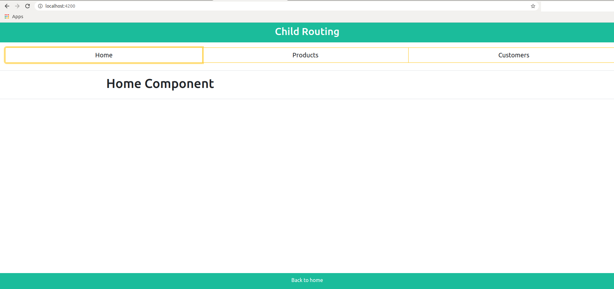
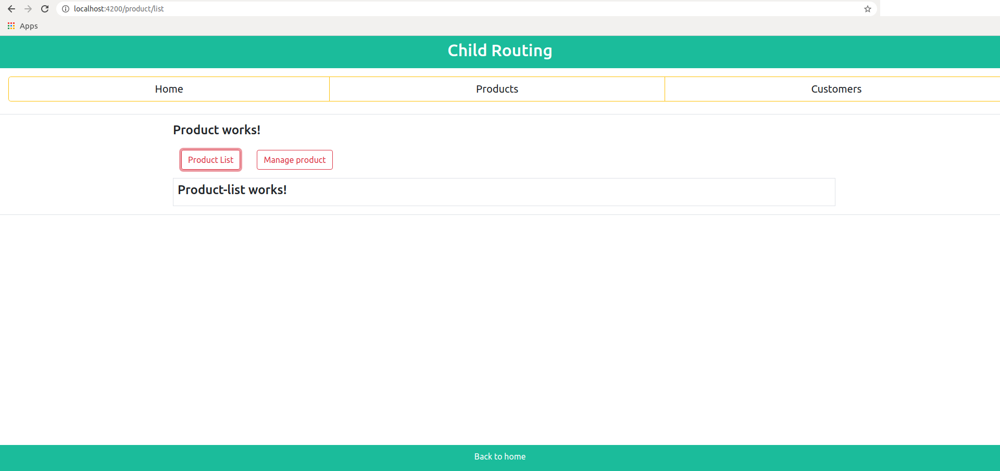
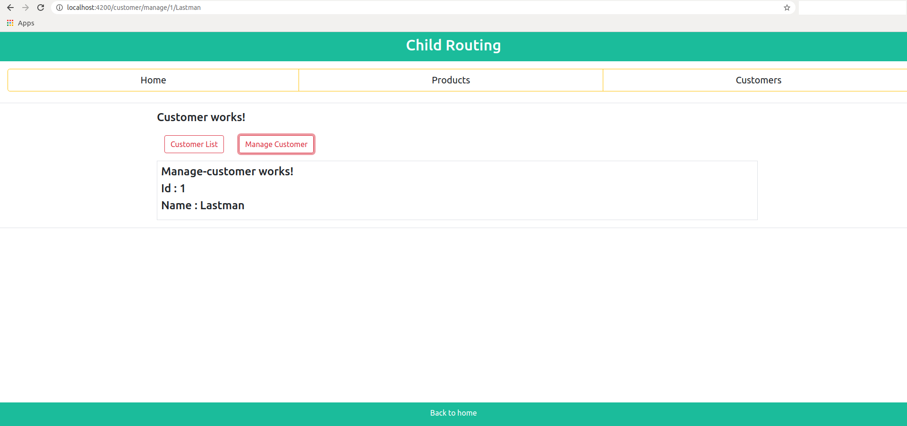

# Angular Child Routing Example

This application is for how to manage `Child Routing` in angular.\
The Angular Router(`RouterModule`) is what makes an Angular Application a Single Page Application

### 1 Child Routing 

#### 1.1 First step of Child routing is to binding urls to components by the configuration given below : 

```js
const routes: Routes = [
  { path: '', pathMatch: 'full', component: HomeComponent },
  {
    path: 'customer', component: CustomerComponent, children: [
      { path: 'list', component: CustomerListComponent },
      { path: 'manage/:id/:name', component: ManageCustomerComponent }
    ]
  },
  {
    path: 'product', component: ProductComponent, children: [
      { path: 'list', component: ProductListComponent },
      { path: 'manage/:id', component: ManageProductComponent }
    ]
  }
];
```
And add `<router-outlet>` in the App Component :

```js
 <div class="col-6 m-2 p-3 border">
    <router-outlet></router-outlet>
 </div>
```

And bind routes array to RouterModule :

```js
RouterModule.forRoot(routes)
```

This configuration means :

- If you navigate to `/` then the Home component gets displayed
- If you navigate to `/customer` then the Customer component gets displayed
- If you navigate to `/product` then the Product component gets displayed


#### 1.2 For Sub Child Routing :

Add `<router-outler>` to every parent component which has configured children to make hierarchical sub child routing and after that

- If you navigate to `/customer/list` then the Customer List component gets displayed
- If you navigate to `/customer/detail/1/Lastman` then the Manage Customer component gets displayed
- If you navigate to `/product/list` then the Product List component gets displayed
- If you navigate to `/product/detail/1` then the Manage Product component gets displayed


### 2 Steps To Clone It

```
git clone https://github.com/dhruv-rank/angular-9-child-routing-example
cd angular-9-child-routing-example
npm install
```

#### 2.1 To Run On Local-Server :
```
ng serve
```
And start with http://localhost:4200

### 3 Navigate To Routes 

#### 3.1 Navigate To Home



#### 3.2 Navigate To Product List



#### 3.3 Navigate To Manage Customer




### 4 Production Build 

Command to build an application for **production** :

```
ng build --prod --aot=true --build-optimizer=true
```
- --prod flag is added to use production environment profile at build time.  
- The Angular '**aot**' compiler converts your Angular HTML and TypeScript code into efficient JavaScript code during the build phase before the browser downloads and runs that code. Compiling your application during the build process provides a faster rendering in the browser.
- The build-optimizer makes it easier for code minifiers to remove unused code by removing Angular-specific decorators, constructor parameters.
